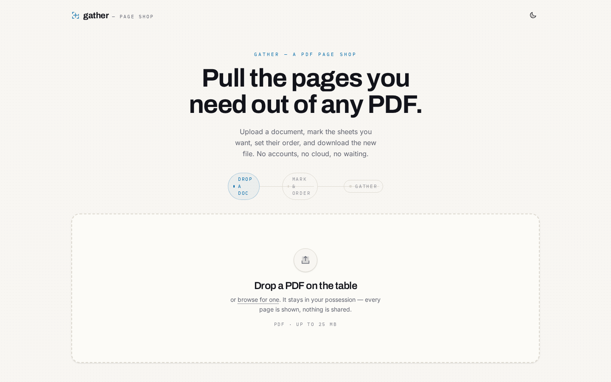
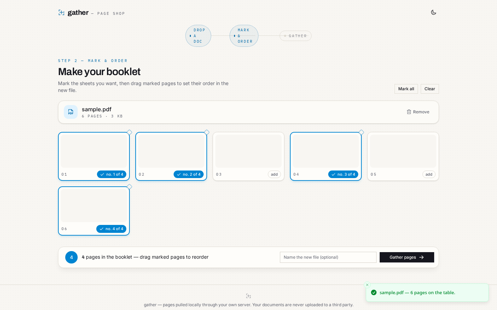
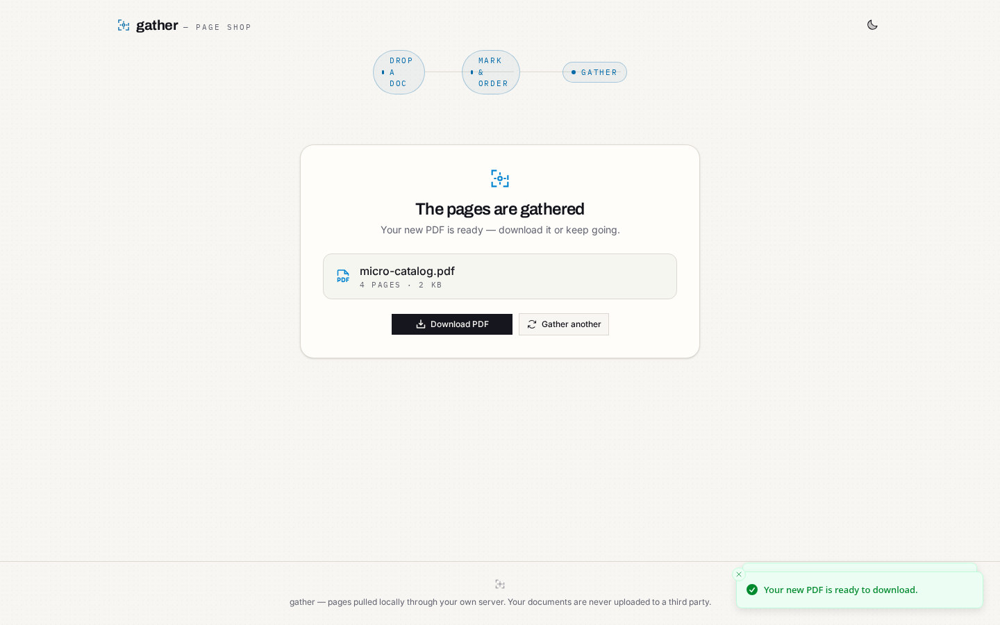
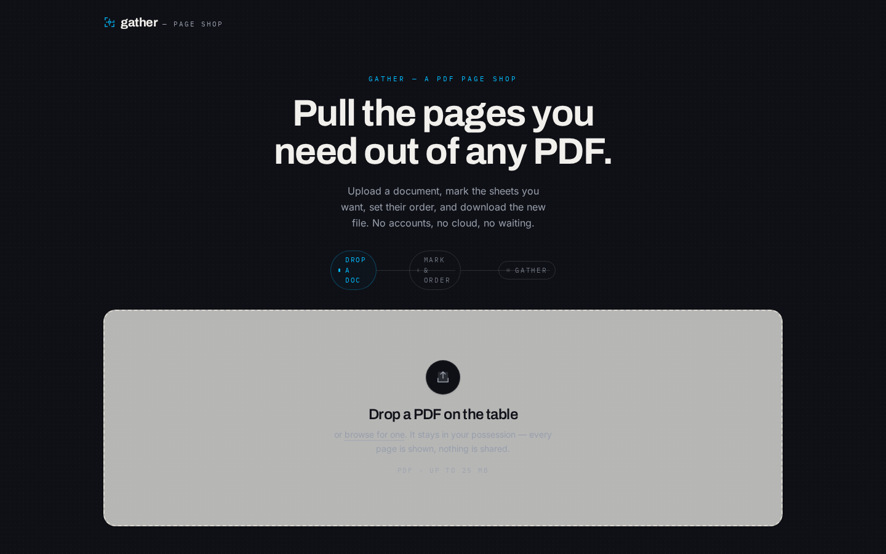

# PDF Page Extractor (`pdf-analyzer`)

Upload a PDF, mark the pages you need, set their order, and download a brand-new PDF.

A small full-stack page extractor with a print-shop soul: paper-white interface, ink
text, printer's-blue for the marks you make, and a registration mark as the signature
motif. Files never leave your own server.

## Problem

People routinely need **a few pages from a large PDF**, in a **custom order**, without uploading documents to a random cloud converter.

## Approach

1. **Client validation** (type, size, `%PDF-` magic bytes) plus server re-validation.
2. **pdf.js** thumbnails for mark-and-drag ordering (duplicates allowed).
3. **pdf-lib** on the server to assemble the output; state survives failed extractions.

## Decisions

| Decision | Why |
|----------|-----|
| Self-hosted | Privacy-sensitive docs stay on your machine/server. |
| Monorepo API + Vite client | Shared types and a single `npm test` story. |
| Real disk storage in API tests | supertest against Express + temp dirs, not mocks only. |

## Results

- **30+** automated tests across client and server.
- Screenshot-documented paper/ink UI themes.

## Screenshots

| Landing (paper theme) | Pages on the table |
| :---: | :---: |
|  |  |

| Extraction result | Ink (dark) theme |
| :---: | :---: |
|  |  |

More: [initial grid](docs/screenshots/03-grid-initial.png) · [mobile](docs/screenshots/02-landing-mobile.png)

## What it does

1. **Upload** — drop a PDF (up to 25 MB). The client validates type, size and the
   `%PDF-` magic bytes; the server re-checks everything and counts the pages.
2. **Mark & order** — every page is rendered as a thumbnail via pdf.js. Tick the pages
   you want; drag marked pages to set their order in the new document (duplicates are
   allowed).
3. **Gather** — the server builds a new PDF from the selection using pdf-lib, storing
   it next to the original. Download it instantly or start over.

Pagination state survives failures: if extraction is rejected (for example an
out-of-range page), your selection stays put with a clear message.

## Running it

Requirements: Node.js **≥ 20**. Everything runs from the repo root.

```bash
npm install     # installs server + client workspaces
npm run dev     # starts the API on :4000 and the client on :5173
```

Then open [http://localhost:5173](http://localhost:5173) — the client proxies `/api`
to the server in dev, so no CORS setup is needed.

### Production-ish

```bash
npm run build -w client       # static site into client/dist
npm start -w server           # API only
```

Serve `client/dist` with any static host and point `VITE_API_BASE` at the API during
the client build if it is not on the same origin.

## Tests

```bash
npm test            # server tests, then client tests (30 client + 17 server)
npm run test:server
npm run test:client
```

The API suite runs against a real Express app + real disk storage in a temp directory
(supertest + vitest). The client suite runs in jsdom with pdf.js stubbed at the module
boundary (testing-library + vitest).

## Configuration

| Env var | Where | Default | Purpose |
| --- | --- | --- | --- |
| `PORT` | server | `4000` | API port |
| `DATA_DIR` | server | `server/data` | Where uploaded/extracted PDFs and metadata live |
| `MAX_UPLOAD_BYTES` | server | `26214400` (25 MB) | Upload ceiling |
| `CORS_ORIGIN` | server | `*` | Allowed browser origin |
| `VITE_API_BASE` | client | `http://localhost:4000` | API origin used by the browser (leave unset in dev; the Vite proxy handles it) |

Copy the examples: `cp server/.env.example server/.env`.

## API

All endpoints live under `/api`. Errors are always JSON: `{ "error": "message" }`.

| Method | Path | Purpose |
| --- | --- | --- |
| `GET` | `/api/health` | Liveness check |
| `POST` | `/api/files` | Upload a PDF (multipart field `file`). Returns document metadata |
| `GET` | `/api/files/:id` | The stored PDF bytes, for inline display or download |
| `GET` | `/api/files/:id/meta` | Metadata for one document |
| `POST` | `/api/files/:id/extract` | Body `{ "pages": [3, 1, 3], "name": "opt.pdf" }`. `pages` are **1-based**, order = output order, duplicates allowed. Returns the new document + `downloadUrl` |
| `DELETE` | `/api/files/:id` | Remove a stored document |

`POST /api/files/:id/extract` example:

```bash
curl -X POST localhost:4000/api/files/<id>/extract \
  -H 'content-type: application/json' \
  -d '{"pages":[5,2,1],"name":"my booklet"}'
# -> { "document": { ... pageCount: 3 ... }, "downloadUrl": "/api/files/<new-id>" }
```

## Design notes

- **Identity.** A print shop, not a SaaS dashboard: paper-warm background with a
  whisper of grain, ink-black buttons, printer's blue reserved strictly for the marks
  you make (selection, numbers, progress). Page numbers are set in a monospaced
  "folio" face; the registration mark appears in the header, the drop zone and the
  result card.
- **Types.** Archivo (display) · Inter (body) · IBM Plex Mono (folio numbers).
- **Theming.** Light ("paper") and dark ("ink") via a toggle, persisted in
  `localStorage`, defaulting to the OS preference.
- **Editing model.** The selection is *ordered*: each selected sheet displays its
  position in the output ("no. 2 of 7"), drag to reorder, HTML5 DnD, keyboard
  accessible checkboxes throughout.

## Architecture

```
pdf-editor/
├── package.json          # npm workspaces: server + client
├── server/               # Express API (Node ESM)
│   ├── src/
│   │   ├── app.js        # app factory (routes, cors, error handler)
│   │   ├── index.js      # entry point
│   │   ├── config.js     # env-driven configuration
│   │   ├── storage.js    # disk-backed document store (pdf + sidecar metadata)
│   │   ├── pdf-service.js# pdf-lib: validation + page extraction
│   │   └── routes/       # /api/files/*
│   └── test/             # supertest + pdf-lib fixture helpers
└── client/               # Vite + React + TypeScript
    ├── src/
    │   ├── lib/          # api client, pdf.js renderer, theme hook
    │   ├── components/   # drop zone, page grid/cards, extract bar, result panel
    │   └── ui/           # vendored shadcn/ui components (radix)
    └── vitest.config.ts
```

Key decisions:

- **Previews on the client.** pdf.js renders page thumbnails in the browser from the
  stored PDF served by the API — no native canvas/poppler binary on the server.
- **Extraction on the server.** `pdf-lib` copies the selected pages (with order and
  duplicates) into a fresh PDF that streams as `attachment` over `/api/files/:id`.
- **Defense in depth.** Validation happens in the browser (UX) *and* on the server
  (truth): mimetype, size ceiling, `%PDF-` magic bytes, parse check, and a
  password-protected-PDF guard with human-readable errors.
- **Extracted documents are ordinary documents**, stored under the same schema with
  an `extractedFrom` pointer, so the whole API treats them identically.

## What's intentionally out

- No user accounts, no cloud storage — matching its aim of being a self-contained
  local utility. (Bonus item from the brief, deliberately traded for simplicity.)
- Files are removed with `DELETE /api/files/:id`; there is no scheduler for orphan
  cleanup, so keep the uploads folder tidy on busy servers.

## License

MIT — the work in this repository is original.